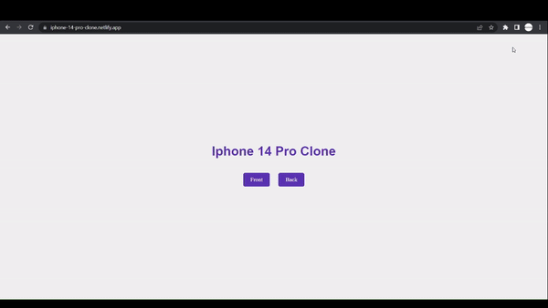

# iPhone 14 Pro Clone

Welcome to the iPhone 14 Pro Clone project repository! This project aims to recreate the front and back side of the iPhone 14 Pro using HTML and CSS.

  

## Project Description

This project is a visual representation of the iPhone 14 Pro, showcasing its front and back design. It provides a simulated experience of interacting with the device, allowing users to explore its features and aesthetics.

## Preview

You can preview the project by visiting the following link:

[View Live Demo](https://iphone-14-pro-clone.netlify.app/)

## Features

- Accurate replication of the iPhone 14 Pro's front and back design.
- Interactive elements and animations to simulate real-world interactions.
- Responsive layout for optimal viewing on different devices and screen sizes.

## Technologies Used

- HTML
- CSS

## Usage

To use the project, simply open the `index.html` file located in the respective `Front` and `Back` folders. This will launch the front and back side of the iPhone 14 Pro in your web browser.

## License

This project is licensed under the [MIT License](LICENSE).

